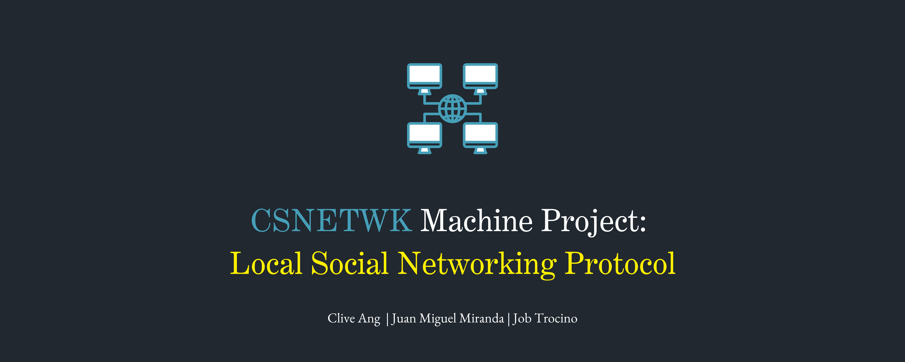

## Introduction

A decentralized communication framework designed for local area networks. This Python implementation of LSNP enables peer-to-peer social networking within LANs using simple plaintext messaging over UDP, making it ideal for environments where traditional social networking infrastructure isn't accessible.

## File Structure

```
CSNETWK-MP/
├── src/
│   ├── app.py             # Main application controller
│   ├── core/
│   │   └── state.py       # Global application state management
│   ├── handlers/          # Message type handlers
│   │   ├── dm_handler.py
│   │   ├── file_handler.py
│   │   ├── game_handler.py
│   │   ├── group_handler.py
│   │   ├── like_handler.py
│   │   ├── message_router.py
│   │   ├── ping_handler.py
│   │   ├── post_handler.py
│   │   └── profile_handler.py
│   ├── models/            # Data models
│   │   ├── game.py        # Tic-Tac-Toe game models
│   │   ├── group.py       # Group and group message models
│   │   └── user.py        # User, peer, and message models
│   ├── network/           # Network communication layer
│   │   ├── client.py      # Network manager and utilities
│   │   ├── listener.py    # UDP message listener
│   │   └── protocol.py    # Message parsing and building
│   ├── services/          # Business logic services
│   │   ├── file_service.py
│   │   ├── game_service.py
│   │   ├── group_service.py
│   │   ├── message_service.py
│   │   ├── ping_service.py
│   │   └── user_service.py
│   ├── ui/                # User interface components
│   │   ├── components.py  # Shared UI utilities
│   │   ├── dm_menu.py     # Direct messaging interface
│   │   ├── file_menu.py   # File sharing interface
│   │   ├── game_menu.py   # Tic-Tac-Toe game interface
│   │   ├── group_menu.py  # Group messaging interface
│   │   ├── main_menu.py   # Main application menu
│   │   ├── peer_menu.py   # Peer discovery interface
│   │   └── posts_menu.py  # Social posts interface
│   └── utils/             # Utility functions
│       ├── auth.py        # Authentication and token management
│       ├── dedupe.py      # Message deduplication
│       └── setup.py       # Initial user setup
└── main.py                # Application entry point
```

## Prerequisites

- **Python 3.7+** - Required for running the application
- **Local Area Network** - All users must be on the same network subnet
- **Firewall Configuration** - UDP port 50999 must be open for communication
- **Administrator Privileges** - Required on Windows for firewall rule creation

### Network Requirements
- All devices must be on the same subnet (e.g., 192.168.1.x)
- UDP broadcast packets must be allowed on the network
- Port 50999 must be available and not blocked by firewalls

## Installation

1. **Clone the repository**
   ```bash
   git clone https://github.com/JeyyM/CSNETWK-MP.git
   cd CSNETWK-MP
   ```

2. **Verify Python installation**
   ```bash
   python --version
   # Should show Python 3.7 or higher
   ```

3. **No additional dependencies required** - The application uses only Python standard library modules

## Network Setup

### Windows (PowerShell as Administrator)
```powershell
# Create firewall rule to allow LSNP traffic
New-NetFirewallRule -DisplayName "LSNP UDP 50999" -Direction Inbound -Action Allow -Protocol UDP -LocalPort 50999

# To remove the rule when done (for security)
Remove-NetFirewallRule -DisplayName "LSNP UDP 50999"
```

### Linux/macOS
```bash
# Check if port 50999 is available
netstat -ul | grep 50999

# If using ufw (Ubuntu/Debian)
sudo ufw allow 50999/udp

# If using firewalld (CentOS/RHEL)
sudo firewall-cmd --add-port=50999/udp --permanent
sudo firewall-cmd --reload
```

## Usage

### Starting the Application
```bash
python main.py
```

### First-Time Setup
1. Choose **verbose mode** (recommended for debugging)
2. Enter your **username** (will be used as your identifier)
3. Enter your **display name** (shown to other users)
4. Set your **status message** (optional)

### Main Menu Options
- **0** - Toggle verbose logging on/off
- **1** - View discovered peers and their profiles
- **2** - Access posts feed (view/create social posts)
- **3** - Send direct messages to other users
- **4** - Create/join groups and send group messages
- **5** - Share files with other users
- **6** - Play Tic-Tac-Toe with other users
- **7** - View and edit your profile
- **8** - Exit the application

### Basic Workflow
1. **Start the application** and complete initial setup
2. **Wait for peer discovery** (other users will appear automatically)
3. **Begin interacting** through messaging, file sharing, or games
4. **Use verbose mode** to see network activity and debugging information

## Architecture

LSNP follows a decentralized peer-to-peer architecture with the following components:

### Core Components
- **NetworkManager** - Handles UDP communication and message routing
- **UDPListener** - Listens for incoming messages on port 50999
- **MessageRouter** - Routes incoming messages to appropriate handlers
- **Application State** - Maintains peer lists, conversations, and game states

### Service Layer
- **UserService** - Manages peer discovery and profile broadcasting
- **MessageService** - Handles direct messages and posts
- **GroupService** - Manages group creation and messaging
- **GameService** - Coordinates multiplayer Tic-Tac-Toe games
- **FileService** - Handles peer-to-peer file transfers
- **PingService** - Maintains peer presence and heartbeat

### User Interface
- **Terminal-based menus** for all user interactions
- **Real-time updates** for messages and game states
- **Verbose logging** for network debugging

### Data Flow
1. **Outgoing**: UI → Service → NetworkManager → UDP Broadcast/Unicast
2. **Incoming**: UDP Listener → MessageRouter → Handler → Service → UI Update

## Protocol

LSNP uses a custom text-based protocol over UDP with the following message format:

### Message Structure
```
TYPE: [MESSAGE_TYPE]
USER_ID: [username@ip_address]
FIELD_NAME: [field_value]
...

[Optional message body]
```

### Message Types
- **PROFILE** - User profile broadcasts for peer discovery
- **PING/PONG** - Heartbeat messages for presence tracking
- **POST** - Social media posts
- **CHAT** - Direct messages between users
- **GROUP_CHAT** - Group messaging
- **GAME_INVITE** - Tic-Tac-Toe game invitations
- **GAME_MOVE** - Game move updates
- **FILE_OFFER** - File sharing offers
- **FILE_ACCEPT** - File transfer acceptance
- **ACK** - Message acknowledgments
- **REVOKE** - Token revocation for logout

### Authentication
- **Token-based security** with scope validation
- **Automatic token generation** for different message types
- **Token expiration** and renewal mechanisms
- **Scope verification** (broadcast, chat, presence, file, game)
